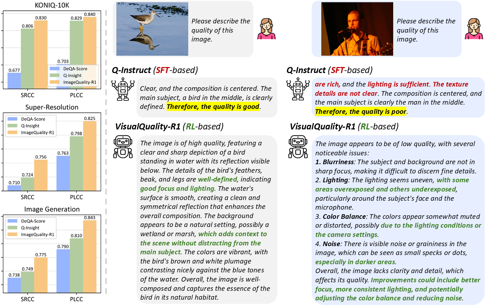

<div align="center">

# 🐍 *ImageQuality-R1*: Reasoning-Induced Image Quality Assessment via Reinforcement Learning to Rank

This is the official code for ImageQuality-R1.

<p align="center">
    
</p>

<a href="https://huggingface.co/TianheWu/ImageQuality-R1-v1" target="_blank">
    
</a>

</div align="center">

## Quick Start

This is the demo for inference one image quaity score and it's corresponding reasoning content.
```
from transformers import Qwen2_5_VLForConditionalGeneration, AutoTokenizer, AutoProcessor
from qwen_vl_utils import process_vision_info

import json
import numpy as np
import torch
import random
import re
import os


def score_image(model_path, image_path):
    model = Qwen2_5_VLForConditionalGeneration.from_pretrained(
        model_path,
        torch_dtype=torch.bfloat16,
        attn_implementation="flash_attention_2",
        device_map=device,
    )
    processor = AutoProcessor.from_pretrained(MODEL_PATH)
    processor.tokenizer.padding_side = "left"

    PROMPT = (
        "You are doing the image quality assessment task. Here is the question: "
        "What is your overall rating on the quality of this picture? The rating should be a float between 1 and 5, "
        "rounded to two decimal places, with 1 representing very poor quality and 5 representing excellent quality."
    )
        
    x = {
        "image": [image_path],
        "question": PROMPT,
    }
        
    QUESTION_TEMPLATE = "{Question} First output the thinking process in <think> </think> tags and then output the final answer with only one score in <answer> </answer> tags."
    message = [
        {
            "role": "user",
            "content": [
                *({'type': 'image', 'image': img_path} for img_path in x['image']),
                {"type": "text", "text": QUESTION_TEMPLATE.format(Question=x['question'])}
            ],
        }
    ]

    batch_messages = [message]

    # Preparation for inference
    text = [processor.apply_chat_template(msg, tokenize=False, add_generation_prompt=True, add_vision_id=True) for msg in batch_messages]
    image_inputs, video_inputs = process_vision_info(batch_messages)
    inputs = processor(
        text=text,
        images=image_inputs,
        videos=video_inputs,
        padding=True,
        return_tensors="pt",
    )
    inputs = inputs.to(device)

    # Inference: Generation of the output
    generated_ids = model.generate(**inputs, use_cache=True, max_new_tokens=256, do_sample=True)
    generated_ids_trimmed = [
        out_ids[len(in_ids):] for in_ids, out_ids in zip(inputs.input_ids, generated_ids)
    ]
    batch_output_text = processor.batch_decode(
        generated_ids_trimmed, skip_special_tokens=True, clean_up_tokenization_spaces=False
    )

    reasoning = re.findall(r'<think>(.*?)</think>', batch_output_text[0], re.DOTALL)
    reasoning = reasoning[-1].strip()

    model_output_matches = re.findall(r'<answer>(.*?)</answer>', batch_output_text[0], re.DOTALL)
    model_answer = model_output_matches[-1].strip()
    score = float(re.search(r'\d+(\.\d+)?', model_answer).group())

    return reasoning, score


random.seed(42)
device = torch.device("cuda:0") if torch.cuda.is_available() else torch.device("cpu")

### Modify here
model_path = ""
image_path = ""

reasoning, score = score_image(
    model_path=model_path,
    image_path=image_path
)

print(reasoning)
print(score)

```
